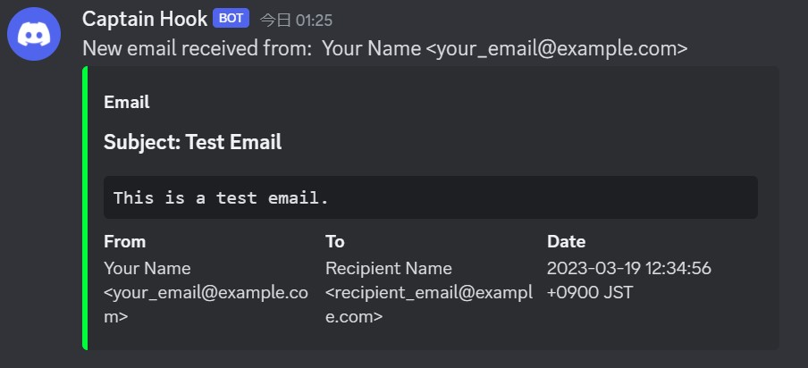

# smtp2discord

This is a simple SMTP server that forwards emails to a Discord channel using a webhook.



## Features

- [x] Forward emails to a Discord channel
- [x] Support encoded email subjects
- [x] Support encoded email body

## Usage

You should set the following environment variables:

- `WEBHOOK_URL`: The URL of the Discord webhook to use.
- `PORT`: The port to listen on. Defaults to `2525`.

### Docker

You can pull the image from the GitHub Container Registry:

`linux/amd64` and `linux/arm64` images are available.

```bash
$ docker pull ghcr.io/32ba/smtp2discord:latest
$ docker run -p 2525:2525 -e WEBHOOK_URL=https://discordapp.com/api/webhooks/... -e PORT=2525 smtp2discord 
```

or build the image yourself:

```bash
$ docker build -t smtp2discord .
$ docker run -p 2525:2525 -e WEBHOOK_URL=https://discordapp.com/api/webhooks/... -e PORT=2525 smtp2discord 
```

### Dev

Local development requires Go 1.16 or later.

```bash
$ go mod download
$ go build -o smtp2discord .
```

## License

This project is licensed under the MIT License - see the [LICENSE](LICENSE) file for details.
